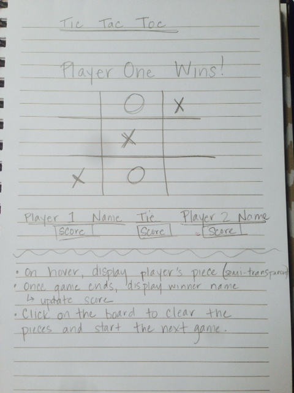
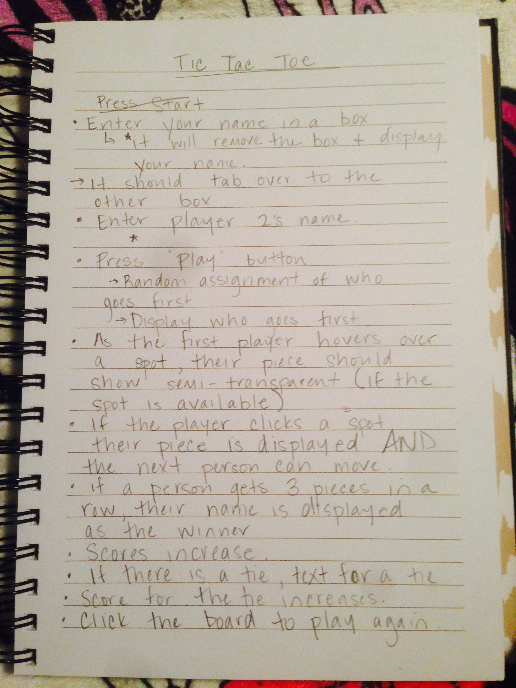

##Approach:
Planning began with a wireframe of the board and other elements that I wanted to appear on the screen: game name, player name, score, tie score (see image 1). 
I then moved on to what I would like the board to do: show the player's piece when hovering over an open spot, have functioning buttons. 
Before I began coding, I worked exactly what my game shoudld be doing as if I were playing the game (see image 2). explanations of the technologies used, the approach taken, installation instructions,

##Unsolved problems:
When hovering over an available square, you do not see their piece. Instead, I opted for changing the color of the square when the mouse hovers.

When two players tie, the game does not automatically announce this. 
When two players tie, the game does not give you the button to clear the board.
I unsuccessfully tried to declare a tie a few ways: 
  `1.` I set a variable called "tie" to true. If one of the if statements for winning was met, the "tie" variable became false. Depending on whether the "tie" variable was true or false was supposed to produce a different statement when the game was over. Both statements were to prompt the function to clear the board. 
  `2.`I set a counter so that each time a player clicked a space, the counter would go up. If the counter hit nine and did not meet any of the if criteria, the game would be declared a tie. 
  `3.`I set an if statment for my array so that if my board is full, the statement would declare that we have a tie and the clear function would be prompted.

###Image 1:

###Image 2:

